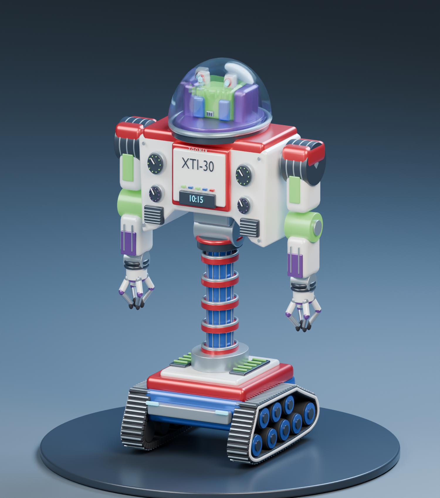

# Zoomer XTI-30

An articulated Blender robot based on `zoomer.png`, with a MuJoCo motor model, URDF, and print prototypes for a Prusa XL with five tools. The neutral model is 180 mm tall and 100 mm wide. The head, chest instruments, ribbed cylinder, tread base, and four-finger hands follow the drawing.



The revised tread layout is shown in the [side elevation](renders/zoomer_treads_side.png). The steep end is the front; the long upper slope faces rearward.

## Revised modular print

For the physical model, use [the modular print revision](print/modular/PRINTING.md). It follows the drawing's wider proportions at 180 mm tall, uses 12 printed parts and keeps only head and shoulder movement. All hardware is printed plastic. The main parts lie flat for printing; the clear dome has its own supported print.

Start with [the fit coupons](print/modular/plates/XL_fit_coupons.3mf), then choose [single-material](print/modular/plates/XL_main_single_material.3mf) or [five-color](print/modular/plates/XL_main_five_color.3mf). See the [drawing comparison](print/modular/qa/drawing_comparison.png) and [Blender inspection model](assets/zoomer_modular.blend). The files under `print/articulated/` are the earlier captive-joint prototype.

The user subsequently printed the modular robot and reported good fits, but insufficient dome clarity. The [three-piece vase dome](print/vase_dome/PRINTING.md) replaces that cover with a continuous thin shell, separate cap and mounting ring. Its two PrusaSlicer projects use 0.25 mm layers; only the shell uses vase mode. Open the [revised inspection scene](assets/zoomer_vase_dome.blend) to examine it.

The curved vase dome improved transparency in the user's print, but distorted the image. The next [flat viewing covers](print/flat_window_domes/PRINTING.md) include a flat-wall test, a faceted vase shell and a normal-printed hood that holds a 0.50 mm clear PETG sheet window. Four sliced XL projects, a full-size cutting template and both Blender inspection models are included. These new variants have not yet been physically printed.

## Drawing and training

The retrained robot completes the 19-stroke "ai is so cool" drawing with 0.36 mm RMS tracking error and returns all four markers. Open [the video player](app/video.html) or [the MP4](renders/zoomer_ai_is_so_cool.mp4). The final frame compares the target with measured ink. See [training details](simulation/TRAINING.md) for the evaluated run and simulation assumptions.

Open the local drawing studio with `.venv/bin/python app/server.py`, then visit <http://127.0.0.1:8765>. It records four-color drawings and launches curriculum training for marker collection, drawing and color changes. The default position tolerance is 3 cm RMS.

See [the workshop guide](simulation/TRAINING.md) for the simulator, learned policy, visibility checks, error calculation and commands. The [integrated articulation design](print/articulated/PRINTING.md) is separate from the original static print.

The saved PPO policy completed the four-color example in 399.42 simulated seconds, with 1.57 cm RMS error and all markers returned. This is a small controller-assisted learning test. See the workshop guide for its scope and physics assumptions.

The earlier captive mechanism is preserved in `assets/zoomer_print_in_place.blend` and `print/articulated/`. Use the modular revision above for the revised physical model.

## Open the model

Open [`assets/zoomer.blend`](assets/zoomer.blend) in Blender 4.5 or later. Frame 1 is the neutral pose. Play frames 1 to 250 for the articulation demonstration.

The `01 | Joint controls (degrees)` collection contains the joint hierarchy. Select a joint and edit its `command_deg` custom property. Clear that property's keyframes before posing it manually. Each axis has its own pivot and limit. Geometry moves as rigid parts, with no skin deformation. The dome and head rotate together through a continuous yaw joint.

The drawing is packed into the Blender file in the hidden reference collection. The studio floor, plinth, lights, and cameras are separate from the robot.

## Articulation

| Assembly | Motor channels | Motion |
| --- | ---: | --- |
| Waist | 2 | Continuous yaw; pitch ±25° |
| Head and dome | 1 | Continuous yaw |
| Each arm | 7 | Three shoulder axes, elbow flexion, forearm rotation, two wrist axes |
| Each hand | 8 | Four fingers with two hinges each |
| Base | 2 | Independent left and right drive motors |
| Total | 35 | Plus fourteen passive wheel axles |

The exact axes, ranges, torque assumptions, and ordering are in [`simulation/motor_map.json`](simulation/motor_map.json). Coordinates use metres, +X to the robot's left, -Y forward, and +Z up. The Python design file uses construction coordinates and an explicit `scale_xyz` conversion; the exported Blender, MJCF, and URDF files use metres.

## Run the simulation

```sh
python3 -m venv .venv
.venv/bin/pip install -r requirements.txt
.venv/bin/python simulation/demo.py
```

The demo follows a 10 mm circular tool path in front of a miniature whiteboard. It computes a joint target with inverse kinematics, then applies normalized torque commands at every physics step. It sets the initial joint pose once. The recorded trajectory thereafter comes from MuJoCo dynamics.

On macOS, run the interactive viewer through MuJoCo's launcher:

```sh
.venv/bin/mjpython simulation/demo.py --viewer
```

The three scenes are:

| File | Purpose |
| --- | --- |
| `simulation/zoomer.xml` | Floating base, ground contact, drive motors and arms |
| `simulation/zoomer_fixed.xml` | Fixed base for articulation and controller tests |
| `simulation/whiteboard.xml` | Fixed base, board and an attached marker representation |

[`simulation/control.py`](simulation/control.py) supplies `ZoomerEnv`. `step(action)` accepts 35 normalized torque commands in [-1, 1] and advances 10 ms. Observations include joint positions, velocities, the tool position, and a target position. The reward penalizes target distance and control effort. A tool position within 1 mm counts as success. `command(**named_torques)` provides a named interface. `simulation/zoomer.urdf` and its adjacent `meshes/` directory provide the same visual geometry and joint tree for other robotics tools.

## What the simulation establishes

The validation script loads all three scenes, runs two seconds of dynamics in each, tests all 35 motors individually, compares URDF axes and limits, and checks the circular tool trajectory. Run it with:

```sh
.venv/bin/python scripts/validate_simulation.py
```

Results are saved in [`simulation/validation.json`](simulation/validation.json). The tool trace is in [`renders/whiteboard_trace.svg`](renders/whiteboard_trace.svg), with time samples in the adjacent JSON file.

These three original scenes are controller examples. The separate workshop scene and PPO curriculum are described in `simulation/TRAINING.md`. The circle is a controller demonstration, and there is no physical ink deposition or marker-force model. The marker is attached to the palm rather than grasped as a free object. The environment is a NumPy interface, not a Gymnasium adapter. Outcome descriptions currently need numeric target positions; there is no language-to-task planner.

Masses, inertias, damping, and torque limits are design assumptions, with a total model mass of about 770 g. They are not measurements or hardware specifications. Each track follows the supplied side view: five lower wheels and three upper return rollers inside an asymmetric belt, with a steep front and a sloped rear. Wheel-contact cylinders approximate the belt contact; the first four lower contacts share the ground plane, and the rear wheel sits higher. The visible wheels have blue rims and dark hubs, with an ivory outline around the belt. The fixed-base scenes leave 2 mm beneath the tread contact cylinders so the drive motors can rotate on the bench. The belt does not circulate or deform. Robot self-collision is disabled in the starter scenes; contact with the floor and external objects is enabled. URDF uses cylinders where MJCF uses capsules. Joint sweeps can intersect the cosmetic shells, and a hardware design will need collision-aware motion limits, bearing clearances, motor mounts, wiring paths, and load checks.

## 3D printing

Start with [`print/modular/PRINTING.md`](print/modular/PRINTING.md). The older [`print/PRINTING.md`](print/PRINTING.md) describes the first prototypes. The package contains a fused static display body, a separate dome, five captive-hinge clearance variants, and a captive ball-joint prototype. The newer integrated mechanical design is in `print/articulated/`. Its captive bearings, wheels and linked treads are separate from these first prototypes.

No G-code is supplied. The older captive-joint prototypes have not been physically tested. Use their test parts to establish the printer's clearances before printing the integrated assembly.

## Rebuild

The project was generated with Blender 4.5.3 LTS and validated with MuJoCo 3.14.0. Set `BLENDER` to your Blender executable, then run. On this Mac the executable is `/Users/dgoldenh/Applications/Blender.app/Contents/MacOS/Blender`.

Blender is now 4.5.14 LTS. The modular model passed load, joint-control and render checks after the update. Automated launches on this Mac require the approved execution path outside the restricted sandbox because graphics-device detection crashed there. See the [maintenance record](diagnostics/blender/README.md) and `AGENTS.md` before rebuilding.

```sh
"$BLENDER" --background --python scripts/build_blender.py -- --render
.venv/bin/python scripts/export_simulation.py
.venv/bin/python scripts/validate_simulation.py
.venv/bin/python scripts/build_print.py
"$BLENDER" --background --python scripts/export_print_blender.py
.venv/bin/python scripts/export_display_print.py
```

The model, meshes, renders, and print files are generated artifacts. Edit `scripts/robot_design.py` to change the robot's dimensions or joint tree, then rebuild. The source drawing remains unchanged.

References used for the exports and workflow: [MuJoCo XML reference](https://mujoco.readthedocs.io/en/latest/XMLreference.html), [MuJoCo Python viewer](https://mujoco.readthedocs.io/en/stable/python.html), and [Prusa's modeling guidance](https://help.prusa3d.com/article/modeling-with-3d-printing-in-mind_164135).
