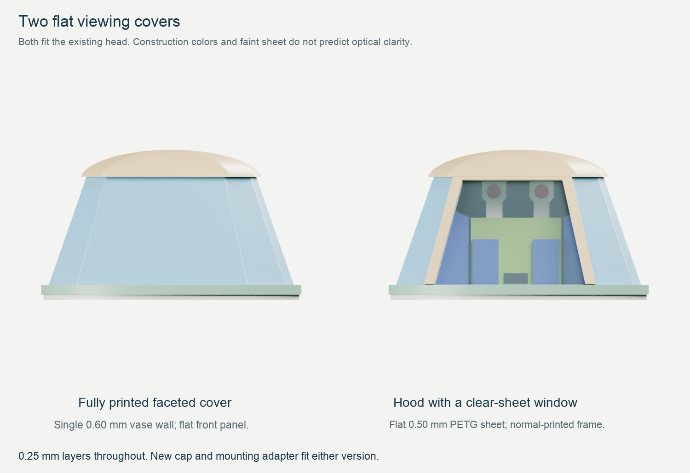
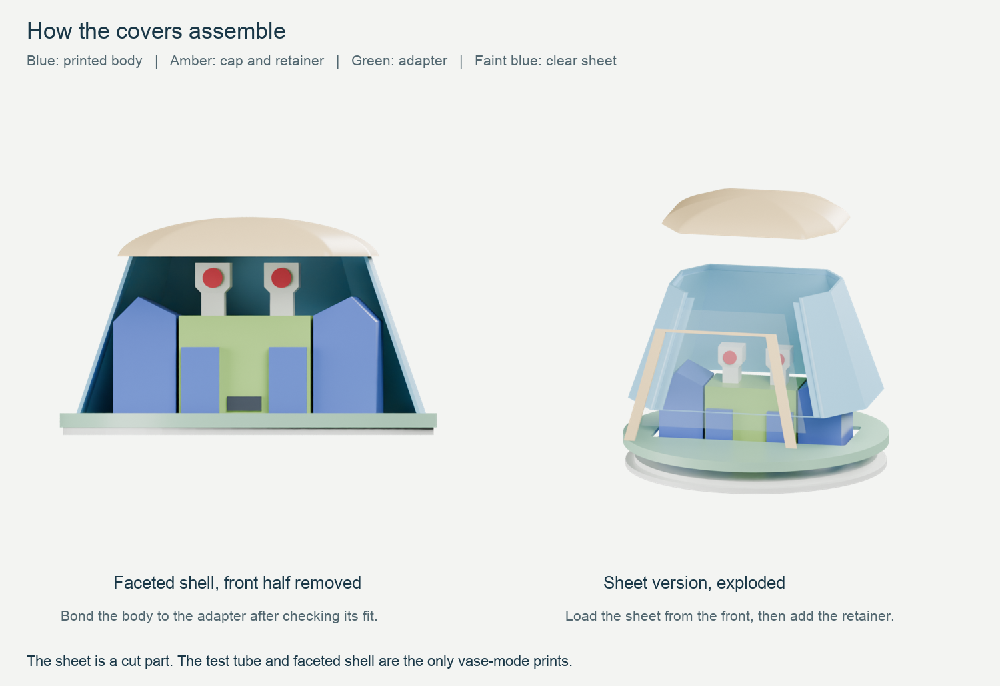

	# Flat viewing covers for Zoomer

These designs follow the curved vase dome that improved transparency but distorted the view of the head. There are two replacement covers and a flat-wall test. They fit the existing modular head and use 0.25 mm layers with 0.4 mm nozzles on the Prusa XL.

The faceted cover keeps the viewing wall printable in vase mode. The sheet-window cover uses a separate piece of 0.50 mm clear PETG sheet across the face. Both use the new cap and mounting adapter in this folder. The old circular cap and ring do not fit them.

## Choose what to print

| Project | Purpose | Mode | Slicer estimate | PETG |
| --- | --- | --- | ---: | ---: |
| [01_XL_flat_wall_test_VASE.3mf](01_XL_flat_wall_test_VASE.3mf) | Optical test only | Vase | 16 min 17 sec | 2.55 g |
| [02_XL_faceted_shell_VASE.3mf](02_XL_faceted_shell_VASE.3mf) | Faceted viewing shell | Vase | 19 min 50 sec | 2.92 g |
| [03_XL_shared_cap_and_adapter_NORMAL.3mf](03_XL_shared_cap_and_adapter_NORMAL.3mf) | Cap and mounting adapter for either cover | Normal | 1 h 3 min 3 sec | 8.82 g |
| [04_XL_sheet_hood_and_retainer_NORMAL.3mf](04_XL_sheet_hood_and_retainer_NORMAL.3mf) | Hood and front retaining frame for the sheet version | Normal | 47 min | 4.96 g |

For the fully printed cover, print projects 02 and 03. For the sheet-window cover, print projects 03 and 04 and cut one clear sheet panel. Print project 03 twice if you want two complete covers. A loose cap can be transferred between them; each cover's adapter is normally bonded to its body.

Open each file as a PrusaSlicer project to load its embedded settings. All four use clear PETG in tool 1; the other four tools are unused. Check that tool 1 has the intended material before exporting G-code. Keep the supplied orientations and 100% scale.

## Try the flat-wall test first

The test is a 50 by 32 by 20 mm open tube with rounded corners. Its broad walls are flat. Hold the head or a printed target inside the tube and look through **one wall only**. Move the tube up or down to examine the eyes and mouth separately. The test is not a mounting part and should not be forced onto the head lip.

The [cutting-template PDF](templates/clear_sheet_cutting_template.pdf) includes a contrast target. Hold it roughly 10 to 15 mm behind one broad wall and compare it with the uncovered target at the same distance. A target placed outside the opposite side of the tube would be viewed through two walls, which gives a misleading result.

If the flat wall looks clear enough, continue with the faceted shell. If it still produces strong ripples, the sheet-window version avoids printing the optical surface. Neither new design has been physically tested.

## Print settings

| Setting | Test and faceted shell | Cap, adapter, hood and retainer |
| --- | --- | --- |
| First layer / remaining layers | 0.25 / 0.25 mm | 0.25 / 0.25 mm |
| Extrusion width | 0.60 mm | 0.45 mm |
| Perimeters | One continuous spiral | Three where space permits |
| Infill | 0% | 100% rectilinear |
| Top / bottom solid layers | 0 / 0 | 4 / 3 |
| Wall speed | 15 mm/s | 15 mm/s |
| Nozzle / bed | 250 / 85 degrees C | 250 / 85 degrees C |
| Extrusion multiplier | 1.00 | 1.00 |
| Fan range | 0 to 15% | 30 to 50% |
| Supports | Off | Off |
| Brim | 4 mm, 0.10 mm separation | Same |

These retain the settings from the previous vase experiment. Use dry filament, a PETG-compatible print sheet and a nozzle temperature within the spool's stated range. Judge geometry changes with the same material and settings first.

The two vase STLs are intentionally solid outer shapes. The slicer turns them into open, single-wall parts. Their sliced previews must show no floor, infill or roof. Do not use the thin meshes in `inspection_only/` as vase inputs, and do not combine a vase shell and fittings into one vase-mode job.

The faceted front panel leans back by 14.49 degrees but remains a plane. Its nominal width narrows from 40 to 27.2 mm; corner rounding slightly shortens the straight edges. The steepest panel moves inward only 0.085 mm per layer, leaving about 86% nominal overlap with the previous 0.60 mm extrusion. Rounded corners lie outside the main viewing area.

## Assemble the faceted cover

1. Let the parts cool and remove the brim. Support the thin shell at its lower edge while trimming it.
2. Place the adapter on the head. Its circular recessed underside fits around the existing 55 mm lip. Its flat top points upward. The long direction of its rectangular opening runs across the face.
3. Center the shell on the adapter's flat top. A broad flat panel faces forward. The shell rests on the top surface; it is not a press fit into a socket.
4. Fit the cap gently to the shell's narrow upper edge. Its annular groove locates the edge. Align the broad front face of the cap with the broad front face of the shell. There is no snap latch.
5. After checking alignment, bond the shell's lower rim to the adapter with a few small adhesive dots. Keep adhesive away from the head so the complete cover can still lift off. Leave the cap removable, or secure it inside its hidden groove if needed.

Use an adhesive whose manufacturer lists compatibility with the printed plastic. Try it on an offcut first, since some adhesives haze clear PETG. Keep it out of the viewing area. These joints need no screws or metal hardware.

## Cut and assemble the sheet-window cover

Use flat, untextured **0.50 mm clear PETG sheet**, rather than a panel printed in filament. The printed hood supports the sides and back. Its front is open, with shallow ledges for the sheet. A separate U-shaped retaining frame covers the sheet's side and top edges. Its bottom stays open so it does not obscure the low mouth detail.

The panel is a trapezoid, 37.88 mm wide at the bottom, 25.20 mm at the top and 26.60 mm tall along its surface. The [full-size cutting template](templates/clear_sheet_cutting_template.pdf) provides the exact outline. A metric [SVG outline](templates/clear_sheet_outline.svg) is also included.

1. Print the PDF at 100% or Actual size, with Fit and Shrink disabled. Verify its 50 mm scale box with a ruler or calipers. Try a paper cutout in the hood before cutting the plastic.
2. Keep the sheet flat. Cut the narrow edge at the top and remove burrs. The rebate allows 0.20 mm around each edge and 0.10 mm extra depth. Do not heat or bend the sheet.
3. Set the hood on the adapter and check its orientation over the face. The supplied hood prints upright with an open top. Its last 1.25 mm reduces to a thin edge that fits the shared cap. Handle that edge gently.
4. With the cap off, place the sheet into the rebate **from the front**. It does not slide down through the narrow top. Its top edge reaches into the cap's front groove; its bottom rests just above the adapter.
5. Fit the U-shaped retainer over the front. Bond it to the solid side ledges with small adhesive dots, keeping the central sheet clear. There is about 0.10 mm between the retainer and the outer face for the bond. Remove protective film from the bonding surfaces and viewing area as appropriate.
6. Center and bond the hood to the adapter, then lower the cap onto the hood and sheet together. Check the fit before any adhesive sets. Do not push the cap down if the sheet is sitting proud; remove it and correct the sheet seating first.

The adapter prints with its broad top face on the bed, then flips over for assembly. The retainer prints flat. Those orientations are already saved in the projects. The sheet itself is not a printed part.

The cap starts 1.05 mm above the highest eye detail in the nominal assembly. Check visibility from the front when comparing covers. Looking down from above allows the opaque crown to hide more of the eyes.

## Checks and model files

PrusaSlicer 2.9.6 reopened and sliced all four saved projects without warnings. The final paths contain no supports or bridge infill. Both vase jobs have continuous rising extrusion after the first flat loop; the faceted shell has a short reposition at the first-loop transition. All six print inputs are watertight, connected solids.

The geometry check found no interference with the face or between mating parts, apart from negligible numerical contact where the adapter rests on the head. The cap retains at least 0.60 mm of material outside its receiving groove. The sheet frame's opening clears the outer eye tops and lower mouth corners when viewed from the front. Sliced shell paths leave at least 0.20 mm clearance inside the cap's ideal socket. These checks do not establish printed tolerances or optical performance.

Both covers are 33.50 mm tall above the existing head ledge, putting the full robot at about 180.1 mm. The new adapter is 60 mm in diameter, 1 mm wider than the original head deck. The head, body and joints retain their existing geometry.

The workspace inspection scenes are `assets/zoomer_faceted_dome.blend` and `assets/zoomer_sheet_window_dome.blend`. The bundle includes copies in `inspection_only/`. Their head control moves the cover with the head. The sheet is shown faintly for inspection; the renders do not predict clarity. The faceted front wall is removed only in the labeled cutaway view.

Detailed records are in [geometry.json](qa/geometry.json), [validation.json](qa/validation.json), and [the toolpath preview](qa/toolpaths.png). The build scripts are `scripts/build_flat_window_domes.py`, `scripts/validate_flat_window_domes.py`, `scripts/render_flat_window_domes.py`, `scripts/preview_flat_window_domes.py`, and `scripts/make_flat_window_template.py`. Rebuild inside the repository with its print dependencies. Follow `AGENTS.md` for Blender launches on this Mac.
