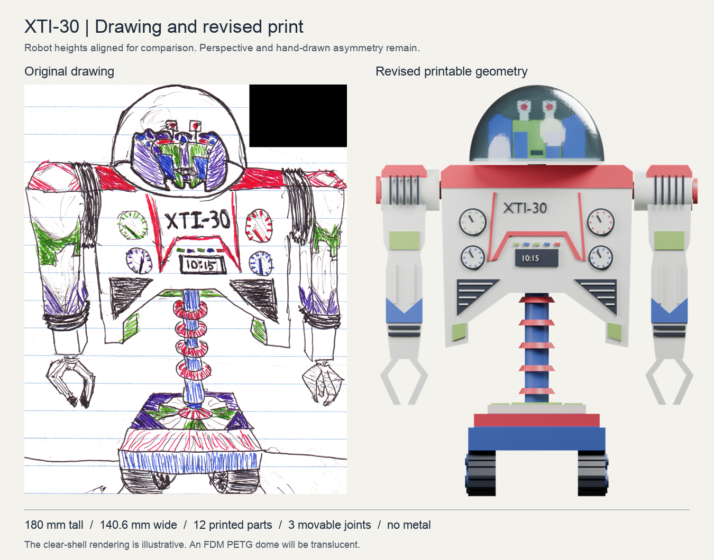
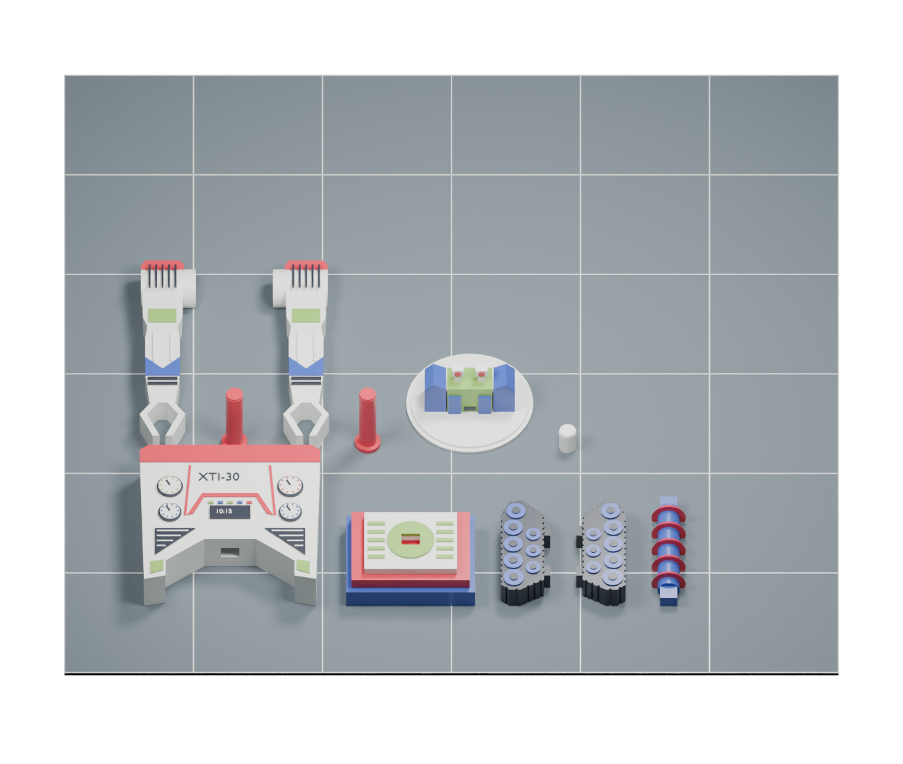
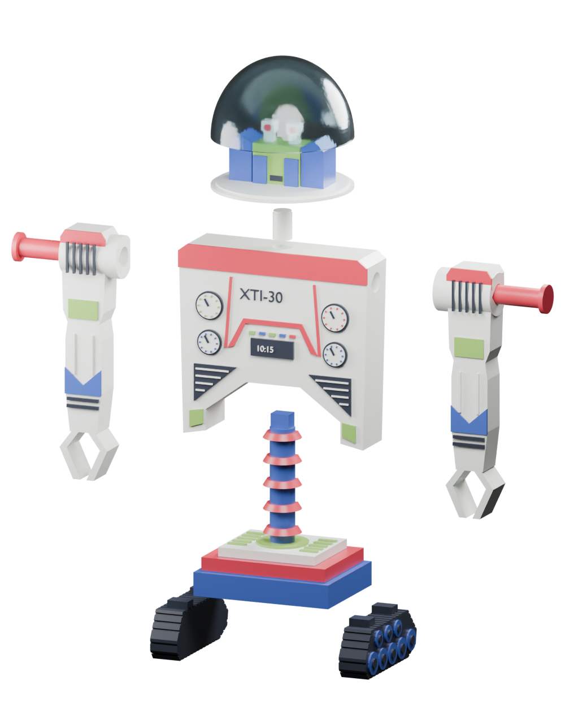

# Modular XTI-30 for the Prusa XL

October 1 update: the user printed this robot and reported good fits. For a thinner replacement cover, use the [three-piece vase dome](../vase_dome/PRINTING.md). Its shell, cap and mounting ring replace the dome described below; the existing head and body remain usable. The replacement dome has passed slicing checks but has not been physically tested.

Use this revision for the physical model. It replaces the 123-volume captive assembly with 12 separate printed parts and three passive joints. The head turns, both shoulders swing, and the hands, waist, wheels and treads stay fixed. There is no metal hardware.

The assembled model is 180 mm tall, 140.6 mm wide and 59 mm deep. All dimensions are in millimetres. Do not rescale the project, because that also rescales its fits.



## Files to open

1. Print [the fit coupons](plates/XL_fit_coupons.3mf) first.
2. Choose either [the single-material main plate](plates/XL_main_single_material.3mf) or [the five-color main plate](plates/XL_main_five_color.3mf). Both contain the same eleven physical parts, already oriented for printing.
3. Print [the separate clear PETG dome](plates/XL_dome_PETG.3mf) if you want the cover.

These are PrusaSlicer projects with the Original Prusa XL five-tool Input Shaper profile, five 0.4 mm nozzles, material settings and bed positions embedded. They were reopened and sliced with PrusaSlicer 2.9.6. Select the filament profile that matches the spool you actually load, and check the tool assignments before exporting your own G-code. The supplied profiles start with Prusament PLA and Prusament PETG. They are starting settings, not measurements of your filament.

The `parts/` directory contains individual STLs already in their print orientations. `assembled/` and `assembly_view_only.3mf` preserve the assembled positions for inspection. Do not print the inspection assembly upright. `../../assets/zoomer_modular.blend` contains the same exported geometry, the packed drawing, and three angle controls.

## What changed and why

| Previous failure point | Revised construction |
| --- | --- |
| Narrow body and long exposed waist | Wider shoulders, an 80 mm chest silhouette and a shorter exposed column, measured against the drawing |
| 121 captive pivots, wheel axles and tread pins | Three assembled plastic bearings |
| Roughly 1 mm finger axles and tiny retaining flanges | Fixed pincers with 3.2 mm wide rails |
| Suspended treads and wheels | Two solid track units, printed with their broad inner faces on the bed |
| Supports trapped around captive joints | Open sockets and separate pins; supports only inside the removable dome |
| Tall, fragile upright body print | Torso, arms and column lie on their rear faces |
| Horizontal column layers at the main load path | The column prints lengthwise along the bed |
| Hard-to-replace failures | Every physical part has its own STL |

Prusa recommends splitting models where this improves orientation and reduces support, and warns that fit depends on material and print direction. That is why this revision includes separate parts and matching fit coupons. [Prusa modeling guidance](https://help.prusa3d.com/article/modeling-with-3d-printing-in-mind_164135)

## Material and settings

Use PLA for the indoor display model. It is the first choice here for the lettering and gauges. Use ordinary, compatible PLA grades for all five structural colors. The raised color regions belong to each part and must bond to it. Clear PETG prints separately for the dome, so the design does not depend on PLA bonding to PETG.

| Setting | Main parts | Fit coupons | Dome |
| --- | --- | --- | --- |
| Layer height | 0.15 mm | 0.15 mm | 0.15 mm |
| First layer | 0.20 mm | 0.20 mm | 0.20 mm |
| Perimeters | 4 | 4 | 3 |
| Infill | 20% gyroid | 100% rectilinear | 0% |
| Top and bottom layers | 5 | 5 | 5 |
| Brim | 3 mm | 3 mm | 4 mm |
| Automatic support | Off | Off | On, snug, from build plate |
| Support contact gap | Not applicable | Not applicable | 0.20 mm |
| External perimeter speed | 30 mm/s | 30 mm/s | 20 mm/s |

The dome is a 1.4 mm nominal shell. Its unsupported crown needs support in this orientation. Remove that support through the full bottom opening before fitting the cover. Clear FDM PETG will usually look translucent and will show layer lines and support contact marks. The render illustrates the head through a clear shell; it does not promise optical clarity. Leaving the dome off is also a usable display option.

The five-color main plate uses tool 1 for ivory, tool 2 for red, tool 3 for blue, tool 4 for green and tool 5 for dark gray. Blue also covers the drawing's purple regions so the body fits five tools. Purple can be painted after printing. The single-material plate uses tool 1 throughout and retains all raised details for painting. The dome uses clear PETG in tool 1 on its separate plate.

On the XL, keep the active tools calibrated and their nozzle seals clean and correctly positioned. Dry filament and ooze prevention matter when tools spend time parked. The five-color project keeps a prime tower away from the parts. It uses one polymer family for the body, which avoids a tower made from materials that do not bond. If you change to mixed polymers or a different support material, recheck both adhesion and tower settings. [Prusa XL material guidance](https://help.prusa3d.com/article/combining-materials-xl_498103)

Use a clean sheet suitable for the loaded material. Smooth PEI suits PLA; satin is a practical choice for the PETG dome. Prusa warns that PETG can bond too strongly to smooth PEI and recommends a separating layer for that combination. [Prusa first-layer guidance](https://help.prusa3d.com/article/first-layer-issues_1804)

## Orientation and handling



This view shows the saved part positions. PrusaSlicer adds the brims and, for five colors, the prime tower.

| Part | Quantity | Supplied orientation | Main concern |
| --- | ---: | --- | --- |
| Torso | 1 | Flat rear down, gauges up | Keep the raised text and dials visible in the sliced preview |
| Base deck | 1 | Underside down | Small track sockets bridge 6.6 mm across their short direction |
| Track unit | 2 | Inner face down, wheel faces up | Alignment keys now extend to the bed; remove brim from their edges |
| Waist column | 1 | Flat rear down | Keep its longitudinal print orientation; do not print upright |
| Arm with fixed hand | 2 | Flat rear down | Clean brim from the fingertips without bending them |
| Shoulder pin | 2 | Flange down | Keep the brim; do not twist a pin into a tight bore |
| Head | 1 | Deck down | Supported cheek bases and sloped socket roof remove the original overhangs |
| Head peg | 1 | Upright | Lightly deburr the tip before checking the head fit |
| Dome | 1 | Open rim down | Remove internal support before assembly |

Check the first layer across the whole plate. The XL's bed size does not make a thin, poorly attached pin reliable. The 3 mm brim addresses the pin adhesion warning found during the first slicing pass. Print the main plate by layer, as supplied. Do not enable sequential printing without checking toolhead clearance.

## Slicer estimates

These are normal-mode estimates from the saved XL projects, including their brims and the prime tower where used. Actual time depends on the printer, filament profile and any setting changes.

| Job | Estimated time | Estimated filament |
| --- | --- | --- |
| Fit coupons | 1 h 33 min | 11.8 g PLA |
| Single-material main plate | 11 h 56 min | 141.5 g PLA |
| Five-color main plate | 14 h 55 min | 165.3 g PLA |
| Separate dome | 1 h 22 min | 15.4 g PETG |

The five-color plate includes 573 tool changes and 22.0 g of prime-tower material. The single-material version is the simpler first print. The final slicing logs contain no support or stability warnings. This is a slicer result, not a guarantee of a successful physical print.

## Fit coupons

The coupons reproduce an 8 mm pin, vertical circular bores, horizontal teardrop bores, and the waist key. The three bore sizes are 8.4, 8.6 and 8.7 mm. These correspond to the torso socket, head socket and arm bearing. Their nominal radial clearances are 0.20, 0.30 and 0.35 mm. The waist key is 8 by 6 mm; its socket is 8.6 by 6.6 mm.

The round-hole bar runs from the smallest bore on the left to the largest on the right. On the long teardrop strip, the smallest bore is nearest the front of the supplied plate. Compare those holes with the printed pin. It should enter the torso socket without force and move freely in the arm and head fits. The rectangular key should enter its socket with room for a thin glue film.

Print the coupons using the same material and settings as the main parts. Remove brim and first-layer burrs before judging a fit. If a fit is tight, lightly sand the pin or key and repeat the check. If the error is large, correct the extrusion or dimensional settings and reprint the coupon. Do not scale the assembled model to correct a local fit. PETG is an alternative for the structural parts, but it needs its own coupon check and filament profiles.

## Assembly



Use a small amount of adhesive rated for the selected plastics, following its instructions. Glue is needed for the fixed keys and pin anchors. No screws, nuts, metal rods, heat-set inserts or springs are required.

1. Dry-fit every connection. Clear the track sockets and the waist mortises. Keep the head and shoulder bearing surfaces free of glue.
2. Glue each track's two keys into the deck. The steep end of each track faces the front. Set both tread bottoms on a flat surface while the glue cures.
3. Glue the lower waist key into the deck. The flat rear of the column faces the rear of the robot. Glue the upper key into the torso, with the dials facing the same direction as the steep track ends. Support the torso until the adhesive cures.
4. Insert each shoulder pin from the outer side of the arm into the torso socket. The large flange stays outside. Glue only the innermost 5 mm of the pin. Press the flange toward light contact with the arm, then leave enough clearance for movement. A thin paper spacer can keep glue and clamping pressure out of the bearing while it cures. Do not glue the arm to the pin. The model includes axial assembly clearance; printed friction and pose holding need adjustment on the actual parts.
5. Glue the head peg into the top of the torso, leaving about 3.5 mm exposed above the chest. Keep that exposed section clean. Lower the head onto the peg and confirm it turns and lifts off.
6. Remove the dome support, clean its rim and place it on the head's outer ledge. The inner locating lip has about 0.6 mm radial clearance. The cover can remain removable. If retention is needed, use small removable adhesive dots on the ledge, away from the head bearing.

Handle the finished model by the deck or torso. The hands and eyes are details, not handles. This is a passive display model, not a powered robot or a load-bearing mechanism.

## Checks and limits

The final part meshes are watertight, each physical part is connected, and the assembled solids have no intersections above the 0.005 mm³ audit threshold. All colored export meshes are also watertight. The checks sample each shoulder from -75 to +75 degrees in 5-degree steps and the head through a full turn in 10-degree steps. None of the 99 sampled poses intersects the stationary assembly.

PrusaSlicer completed the four supplied projects using the embedded XL settings. The main plates and coupons use no support toolpaths. The dome has support enabled and generated. See [the validation record](qa/validation.json), [mesh checks](qa/geometry.json), and the adjacent slicing logs for the exact result and estimates. These checks do not measure layer adhesion, joint wear, printed friction, material shrinkage, optical clarity or actual strength. No physical print has been performed.

## Rebuild

Use a Python environment with the packages in `requirements-print.txt` at the repository root. Blender generates the lettering and inspection renders. The build scripts operate only on this modular print revision.

```sh
python scripts/build_modular_print.py
python scripts/package_modular_print.py
```

The packaging script uses the installed PrusaSlicer application on this Mac. To regenerate lettering first, run Blender with `scripts/modular_text_blender.py`. To rebuild the inspection scene and images, run it with `scripts/render_modular_blender.py`. After slicing the four native projects, `scripts/validate_modular_print.py` checks the exported parts, motion and G-code settings. The source drawing and the trained simulation remain separate.
