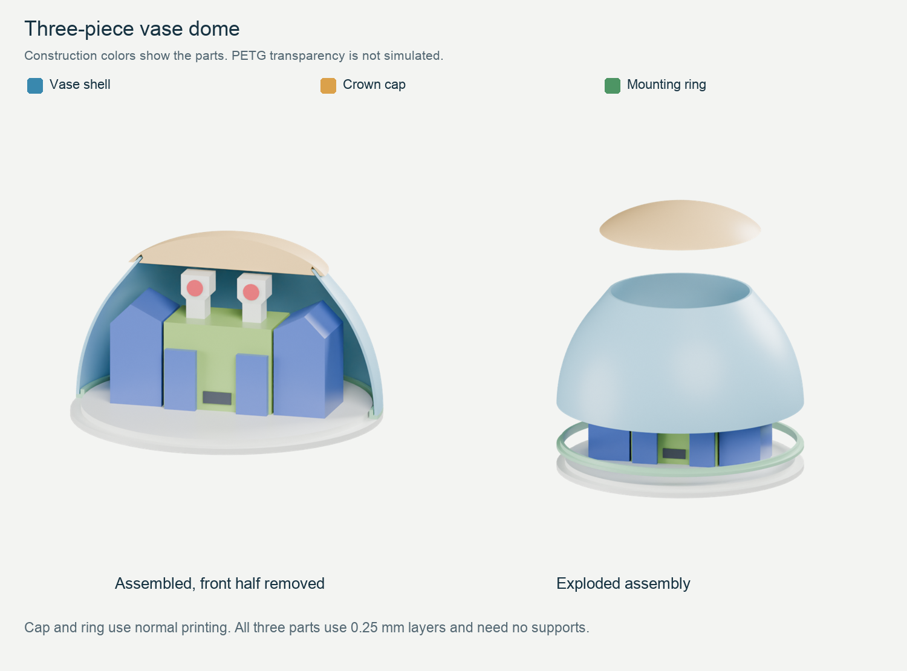
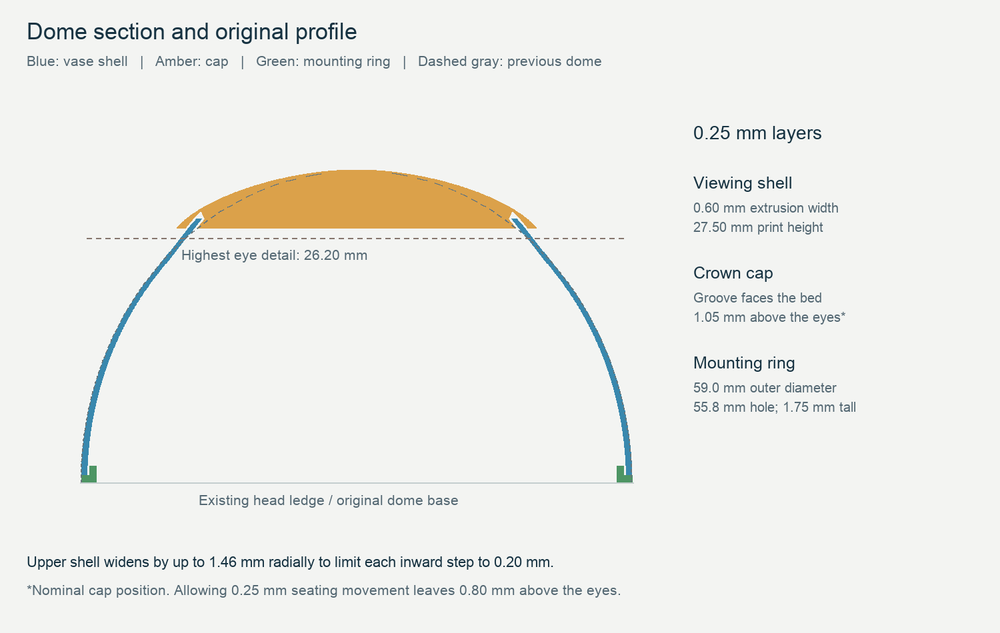
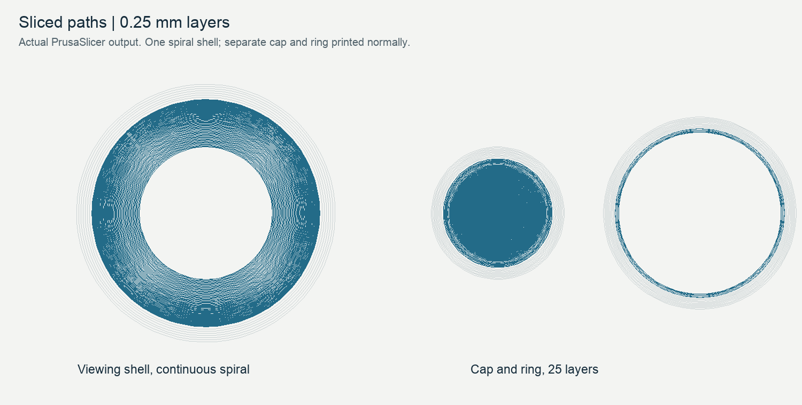

# Vase dome for the existing Zoomer head

Follow-up: the user printed this version and reported improved transparency with lens-like distortion. The [flat viewing alternatives](../flat_window_domes/PRINTING.md) address that result with a faceted shell and a separate clear-sheet window. The original checks below describe the state before that print.

This cover replaces the cloudy dome with three printed parts: a thin viewing shell, a crown cap and a mounting ring. It fits the existing modular head. All connections use plastic; no metal hardware is needed.

The user confirmed that the earlier robot print fit well. This replacement has passed mesh, fit-envelope and PrusaSlicer checks, but has not been physically printed. Its thinner wall may improve visibility; the clarity of the Overture PETG still needs a print test.

## Open these two projects

| PrusaSlicer project | Parts | Mode | Estimated time | PETG |
| --- | --- | --- | ---: | ---: |
| [01_XL_viewing_shell_VASE.3mf](01_XL_viewing_shell_VASE.3mf) | Viewing shell | Spiral vase | 22 min 16 sec | 3.37 g |
| [02_XL_cap_and_ring_NORMAL.3mf](02_XL_cap_and_ring_NORMAL.3mf) | Crown cap and mounting ring | Normal | 42 min 9 sec | 5.84 g |

Open each as a **project** so PrusaSlicer loads its settings. Both use the XL five-tool Input Shaper printer profile with 0.4 mm nozzles, clear PETG in tool 1, and 0.25 mm layers including the first layer. The other tools are unused. Keep the parts at 100% scale and in their supplied orientations. Export G-code for your printer after checking the preview.

Print the shell first and hold it over the face to judge visibility before spending time on the fittings. Let the bed cool before removing it, and support the lower rim while trimming its brim.

The vase STL is deliberately a **solid outer shape**. After slicing, its toolpath must be one wall with an open bottom and open top. Printing that STL with an ordinary profile would create the wrong part. Prusa recommends a solid input for vase mode; the slicer creates the thin wall. [Prusa vase-mode documentation](https://help.prusa3d.com/article/layers-and-perimeters_1748)

Only the viewing shell uses vase mode. The cap's receiving groove and the ring's locating sleeve require normal printing. Combining all three into one vase job would destroy those features.

## Supplied settings

| Setting | Viewing shell | Cap and mounting ring |
| --- | --- | --- |
| Layer height / first layer | 0.25 / 0.25 mm | 0.25 / 0.25 mm |
| Extrusion width | 0.60 mm | 0.45 mm |
| Perimeters | 1, continuous spiral | 3 |
| Infill | 0% | 100% rectilinear |
| Top / bottom solid layers | 0 / 0 | 4 / 3 |
| Wall speed | 15 mm/s | 15 mm/s |
| Solid infill speed | Unused | 20 mm/s |
| Nozzle / bed | 250 / 85 °C | 250 / 85 °C |
| Extrusion multiplier | 1.00 | 1.00 |
| Fan range | 0–15% | 30–50% |
| Brim | 4 mm outer, 0.10 mm separation | Same |
| Supports | Off | Off |

These temperatures and cooling values are trial settings for clear PETG, not a measured calibration of your spool. Check the temperature range on its label. Use dry filament and a PETG-compatible sheet; retain any separating-layer practice required by your sheet. Avoid increasing flow and temperature together, because that makes fit and clarity changes harder to diagnose.

The shell uses a wider single extrusion to keep adjacent loops overlapping as the dome narrows. At its steepest section, each 0.25 mm rise moves inward by 0.20 mm, leaving about two-thirds nominal overlap. The 0.60 mm horizontal wall is about 0.47 mm thick normal to that slope. A separate cap closes the crown, where a continuous unsupported spiral would become unreliable.

Slow printing and reduced cooling are consistent with Overture's transparency guidance. This version keeps the requested 0.25 mm layers and existing 0.4 mm nozzle. It does not establish that those settings will make the face sufficiently visible. [Overture PETG guidance](https://overture3d.com/en-gb/blogs/blogs/petg-filament-guide-3d)

## Orientation and assembly

1. **Print the shell with its large opening on the bed.** The smaller opening stays open. Do not add a bottom, top layers or supports. The first loop and brim are flat; the wall then rises continuously. PrusaSlicer adds a finishing loop at the top.
2. **Print the cap with its groove facing the bed**, as supplied. Its center disk and outer rim initially print as separate regions, then join through a tapered groove roof. Leave it attached to the bed until printing finishes. The final slice has no bridge infill or supports.
3. **Print the ring with its broad flange on the bed.** Its raised sleeve points upward. Remove brim and any first-layer burrs from the fittings before assembly.
4. **Place the ring over the existing head lip.** Its 55.8 mm opening fits around the 55.0 mm lip. It rests on the existing head ledge. The ring is a slip fit, so it will lift off with the cover if the cover and ring are bonded together.
5. **Seat the shell on the ring's ledge.** The ring's raised sleeve goes inside the shell. Hold the shell by its lower rim, without squeezing the sides. If retention is needed, use a few tiny dots of a clear adhesive whose manufacturer lists compatibility with PETG, confined to the hidden base joint. Test it on scrap first; adhesive can haze the viewing area.
6. **Lower the cap onto the shell's upper edge.** The edge enters the annular groove. This is a loose locating fit, not a snap fit. Stop when it seats gently; do not press it down. Leave it removable, or secure it with small adhesive dots inside the hidden groove if needed. Keep the ring free of the head if you want to remove the whole cover later.

The cap starts nominally 1.05 mm above the highest eye detail. Allowing for up to 0.25 mm of seating movement leaves 0.80 mm. The thicker crown therefore stays above the eyes when viewed straight ahead, though it will obscure more of them from above.

If a fit is tight, remove burrs from the rigid cap or ring and try again. Do not force or sand the thin viewing wall. If the shell has gaps, bubbles or loose loops, resolve that print defect before judging optical clarity or applying adhesive.

## Shape and fit

The base remains 59 mm wide. The lower shell follows the previous dome profile; the upper shell widens by up to 1.46 mm radially to reduce the unsupported inward step. The cap has a small overhanging rim to hold its groove and extends up to 2.58 mm radially beyond the previous crown profile. Nominal assembled height is 33.50 mm, versus 33.40 mm for the previous dome, putting the full robot at about 180.1 mm. The body, face and joints retain their existing geometry.

The cap groove is 1.10 mm wide around a nominal 0.60 mm wall. Nominal radial clearance is 0.25 mm on each side. Measured shell toolpaths reduce the smallest outer clearance to about 0.15 mm. The mounting ring has about 0.22 mm minimum radial clearance inside the shell and 0.40 mm around the head lip. These are geometric checks, not a tolerance guarantee for a physical print.

## Validation and files

PrusaSlicer 2.9.6 reopened and sliced both saved projects without warnings. All three STL inputs are watertight and each contains one connected part. The shell's toolpaths rise continuously, contain no infill or support, and stay at or below 15 mm/s. The tapered cap groove closes without bridge infill. Checks found no interfering fit volumes, apart from negligible numerical contact at the ring's resting surface. [Validation results](qa/validation.json) and [geometry measurements](qa/geometry.json) record the details.

The three files in `parts/` are print inputs. The meshes in `inspection_only/` show the parts in assembled positions, including an approximation of the actual thin wall. **Do not use the inspection shell as the vase input.** The bundle includes `inspection_only/zoomer_vase_dome.blend`; the workspace copy is `../../assets/zoomer_vase_dome.blend`. Its head control moves the cover with the head. Construction colors identify the parts and do not simulate PETG clarity.

Rebuild geometry and projects with `scripts/build_vase_dome.py` using the repository's print dependencies. Slice each project to G-code, then run `scripts/validate_vase_dome.py`; it reads `/private/tmp/zoomer_vase_window.gcode` and `/private/tmp/zoomer_vase_fittings.gcode`. Rendering uses `scripts/render_vase_dome.py` with the original modular Blender scene as input and the approved launch procedure in `AGENTS.md`. `scripts/preview_vase_dome.py` creates the assembly card and section. Existing print projects and the original Blender model remain available.
